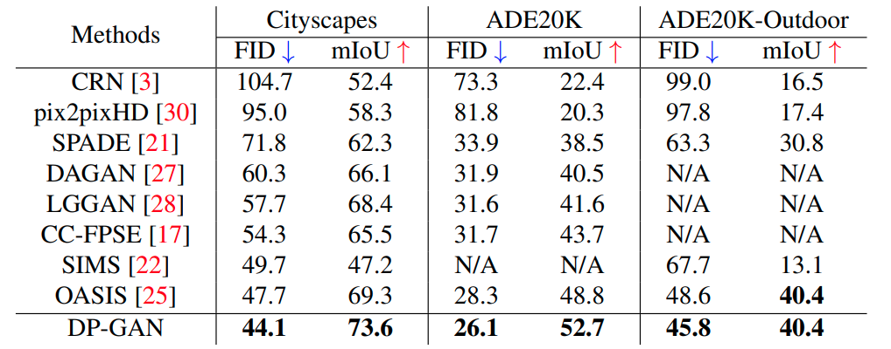

# Dual Pyramid Generative Adversarial Networks for Semantic Image Synthesis

Official PyTorch implementation of the BMVC  2022 paper "Dual Pyramid Generative Adversarial Networks for Semantic Image Synthesis
". The code allows the users to
reproduce and extend the results reported in the study. Please cite the paper when reporting, reproducing or extending the results.

[[Arxiv](https://arxiv.org/abs/2210.04085)]  [[Poster](https://bmvc2022.mpi-inf.mpg.de/0285_poster.pdf)]

# Overview

This repository implements the DP_GAN model, which generates realistic looking images from semantic label maps. In addition, many different images can be generated from any given label map by simply resampling a noise vector (first two rows of the figure below). The model also allows to just resample parts of the image (see the last two rows of the figure below). Check out the paper for details, as well as the appendix, which contains many additional examples.


## Setup
First, clone this repository:
```
git clone https://github.com/sj-li/DP_GAN.git
cd DP_GAN
```
The code is tested for Python 3.7.6 and the packages listed in [environment.yml](environment.yml).
The basic requirements are PyTorch and Torchvision.
The easiest way to get going is to install the dp_gan conda environment via
```
conda env create --file environment.yml
conda activate dp_gan
```
## Datasets

For Cityscapes or ADE20K, please follow the instructions for the dataset preparation as outlined in [https://github.com/NVlabs/SPADE](https://github.com/NVlabs/SPADE).

## Training and Tessting

Please refer to the scripts in ```./scripts```

## Results
Our method outperforms previous methods on almost all metrics

<p align="center">

</p>


## Citation
If you use this work please cite
```
@inproceedings{schonfeld_sushko_iclr2021,
  title={Dual Pyramid Generative Adversarial Networks for Semantic Image Synthesis},
  author={Shijie Li, Ming-Ming Cheng, Juergen Gall},
  booktitle={British Machine Vision Conference},
  year={2022}
}   
```

## Acknowledgement

This code is based on [https://github.com/boschresearch/OASIS](OASIS)

## License

This project is open-sourced under the AGPL-3.0 license. See the
[LICENSE](LICENSE) file for details.

For a list of other open source components included in this project, see the
file [3rd-party-licenses.txt](3rd-party-licenses.txt).
